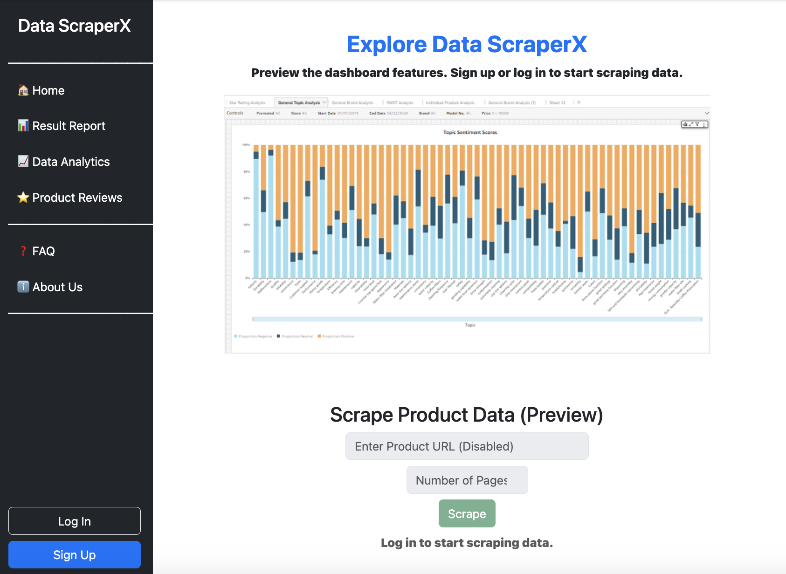
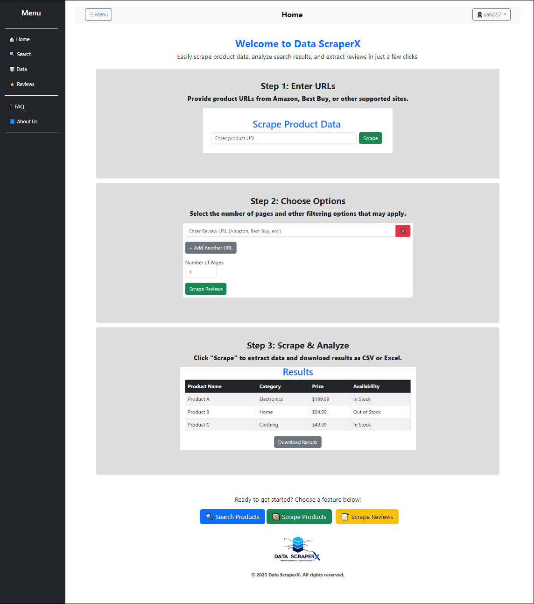
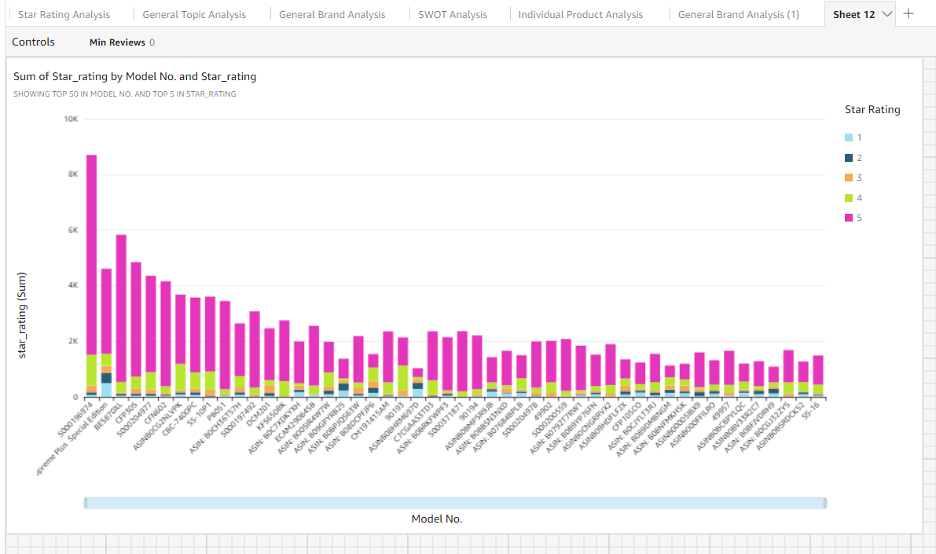

# Table of Contents
- [Team Names](#team-names)
- [Project Description](#project-description)
- [User Interface](#user-interface)
- [Test Plan and Results](#test-plan-and-results)
- [User Manual](#user-manual)
- [User Stories and Design Diagrams](#user-stories-and-design-diagrams)
- [Project Tasks and Timeline](#project-tasks-and-timeline)
- [ABET Concerns Essay](#abet-concerns-essay)
- [PPT Slideshow](#ppt-slideshow)
- [Self-Assessment Essays](#self-assessment-essays)
- [Professional Biographies](#professional-biographies)
- [Budget](#budget)
- [Appendix](#appendix)
# Team Names
### [Almaamar Alkiyumi](#almaamar-alkiyumi-1)
### [Jason Yang](#jason-yang-1)
### [Matt Myers](#j-matthew-myers)
### Matt Hunter (Advisor)
# Project Description
This project focuses on building an improving a web scraper to collect product and review data from e-commerce websites. Using tools like Scraping Bee, AWS, Selenium, and Pandas, the system retrieves, processes, and stores the data for analysis. Key features include cost-effective solutions, user-friendly interfaces, and comprehensive data extraction and analysis functionalities.
# User Interface

# Test Plan and Results
[Test Plan and Results](./Assignments/Semester2/Assignment%20%231%20-%20Test%20Plan.md)
# User Manual
[User Manual](./Assignments/Semester2/Assignment%20%232%20-%20User%20Manual.md)
# User Stories and Design Diagrams
## User Stories
1. As a business analyst, I want to scrape product data from multiple e-commerce websites so that I can efficiently gather information for market research and pricing analysis. 

2. As a developer, I want to update the scraper’s hardcoded components through an easy-to-use interface so that I can quickly adapt to website changes without manual code edits. 

3. As an engineer, I want to scrape data from a specific product page by entering a URL so that I can retrieve the information I need without learning to code. 

4. As a business user, I want to filter the scraped data by specific parameters like price or category so that I can extract only the most relevant information for my reports. 

## Design Diagrams

### Design Level 0

### Design Level 1

### Design Level 2

## Description of Diagrams
### Design Level 0
The user wants to see more detailed information about a product inserts a URL using the web scraper. Goes through cloud services, then returns with specific data on the product.
### Design Level 1
The user wanted to gather more information on the product pricing to compare with other markets, it goes through the cloud service in which depending on who is using the web application returns data that can be analyzed. 
### Design Level 2
This web scraping project allows users to input a product URL into a web scraper UI, which then processes the URL to extract relevant information. The scraper breaks down the URL and sends it to cloud services like Scraping Bee for conversion into an HTML string. This string is passed to Beautiful Soup for parsing, creating a structured HTML object. Pandas is used to extract specific data from the parsed HTML, which is then stored as a CSV file, Excel file, and in AWS S3 storage. The data is analyzed using tools like AWS QuickSight and Hey Marvin AI to provide insights based on user requirements.
# Project Tasks and Timeline
## Task List
### Almaamar Alkiyumi
#### Task List:
1. **Redesign the existing scraper to allow users to target reviews of all products on a specific page** of a website, instead of scraping the entire website.
2. **Redesign the existing scraper to allow users to target reviews of a specific product on a website**, instead of scraping the entire website.
3. **Develop an executable (.exe)** that allows users to easily launch the UI and automatically run all required dependencies for the scraper.
4. **Test and validate the functionality and usability** of both interfaces to ensure they meet specified requirements and perform as intended.
5. **Document the entire project development process**, including detailed steps for setting up, configuring, and running the application. Additionally, create comprehensive user guides for both business users and developers, outlining how to interact with the UI, manage scraping tasks, and monitor website changes.

### Jason Yang
#### Task List:
1. **Develop and refine the existing backend components of the scraper** to be more user-friendly and adaptable to changes.
2. **Research about advanced techniques that can improve the algorithms** for more efficient data scraping and data storage optimization.
3. **Develop and design a developer interface** for developers to manage and update the scraper’s hardcoded components.
4. **Test and troubleshoot** to ensure that the integration within the existing systems are performing as intended.

### Matt Myers
#### Task List:
1. **Evaluate the existing user interface for the web scraper. Document findings.** Note what works and what doesn't. Gather any prior design restrictions and evaluate them to see if they are still applicable.
2. **Design a maintainable user interface following best practices. Document design choices.** Study UI best practices and learn what common pitfalls to avoid.
3. **Research frontend frameworks and make an informed selection for the project. Document rationalization for selection.** Review user testimony for popular frameworks such as React, Svelte, Tailwind CSS, etc. Discuss with team the pros and cons of each and see which would be best for integrating with the rest of the tech stack.
4. **Develop the user interface in the selected frontend framework. Document development process and how maintenance should be performed in order to maintain selected design patterns.** Incrementally implement the features of the user interface. Collaborate on documentation for how the frontend will communicate with the backend.
5. **Gather user feedback on the frontend user experience. Apply the feedback if reasonable and possible.** Seek out possible test users to gather feedback on how the UI is presented, if the operation of the tool makes sense, etc. Apply any recommendations if they are applicable, and update documentation as needed.
6. **Test user interface against multiple different aspect ratios to ensure it is operable and presentable on many different screens. Document any findings during this process.** Ensure that the UI works on several common display sizes and orientations.

## Timeline and Effort Matrix
| Task | Sprints | Effort | Assigned To |
|------|--------:|--------:|-------------:|
| Redesign the existing scraper to allow users to target reviews of all products on a specific page | Jan 6 2025 - Feb 3 2025 | 90% Almaamar, 5% Jason, 5% Matt | Almaamar Alkiyumi |
| Research about advanced techniques that can improve the algorithms | Jan 6 2025 - Feb 3 2025 | 90% Jason, 5% Almaamar, 5% Matt |Jason Yang |
| Research frontend frameworks and make an informed selection for the project. Document rationalization for selection | Jan 6 2025 - Feb 3 2025 | 90% Matt, 5% Jason, 5% Almaamar | Matt Myers |
| Redesign the existing scraper to allow users to target reviews of a specific product on a website | Jan 6 2025 - Feb 3 2025 | 90% Almaamar, 5% Jason, 5% Matt | Almaamar Alkiyumi |
| Evaluate the existing user interface for the web scraper. Document findings | Jan 6 2025 - Feb 3 2025 | 90% Matt, 5% Jason, 5% Almaamar | Matt Myers |
| Document the entire project development process | Jan 6 2025 - Mar 3 2025 | 90% Almaamar, 5% Jason, 5% Matt | Almaamar Alkiyumi |
| Design a maintainable user interface following best practices. Document design choices | Feb 3 2025 - Mar 3 2025 | 90% Matt, 5% Jason, 5% Almaamar | Matt Myers |
| Develop and refine the existing backend components of the scraper | Feb 3 2025 - Mar 3 2025 | 90% Jason, 5% Almaamar, 5% Matt | Jason Yang |
| Develop the user interface in the selected frontend framework. Document development process and how maintenance should be performed in order to maintain selected design patterns | Feb 3 2025 - Mar 3 2025 | 90% Matt, 5% Jason, 5% Almaamar | Matt Myers |
| Develop and design a developer interface | Feb 3 2025 - Mar 3 2025 | 90% Jason, 5% Almaamar, 5% Matt | Jason Yang |
| Develop an executable (.exe) | Mar 3 2025 - Apr 7 2025 | 90% Almaamar, 5% Jason, 5% Matt | Almaamar Alkiyumi |
| Gather user feedback on the frontend user experience. Apply the feedback if reasonable and possible | Mar 3 2025 - Apr 7 2025 | 90% Matt, 5% Jason, 5% Almaamar | Matt Myers |
| Test and validate the functionality and usability | Mar 3 2025 - Apr 7 2025 | 90% Almaamar, 5% Jason, 5% Matt | Almaamar Alkiyumi |
| Test and troubleshoot | Mar 3 2025 - Apr 7 2025 | 90% Jason, 5% Almaamar, 5% Matt | Jason Yang |
| Test user interface against multiple different aspect ratios to ensure it is operable and presentable on many different screens. Document any findings during this process | Mar 3 2025 - Apr 7 2025 | 90% Matt, 5% Jason, 5% Almaamar | Matt Myers |

# ABET Concerns Essay
## Economic Constraints
Although Midea has agreed to fund the project, the budget is limited to less than $200 per month. This constraint requires the team to manage resources carefully, ensuring that the use of paid services like AWS and Scraping Bee stays within the monthly budget. Balancing performance with cost efficiency will be key. The team might need to explore cost-saving alternatives, such as optimizing the number of API calls or using free-tier services wherever possible. This financial limitation could influence the scale and frequency of data collection.
## Security Constraints
Security is a crucial factor due to the nature of web scraping and data storage. The project involves accessing and storing data from e-commerce websites, which raises concerns about data protection and privacy. It's important to ensure that sensitive information is not exposed during the scraping process or while storing it in cloud services like AWS. The team must implement proper encryption, access controls, and regular security audits to prevent unauthorized access and ensure compliance with data privacy regulations.
## Legal Constraints
There are potential legal challenges in web scraping, particularly concerning the terms of service of websites being scraped. Many websites have restrictions on automated data extraction, and violating these terms could lead to legal issues. The team needs to ensure that the scraping activities comply with all relevant regulations, such as not scraping private or copyrighted content without permission. This legal constraint may limit the scope of websites that can be targeted and require a thorough review of each website's legal policies before scraping.
## Ethical Constraints
The project must address ethical concerns regarding data collection, especially when scraping user reviews and product information. Ensuring that the collected data is used in a fair and transparent manner is essential to avoid harm to individuals or businesses. Ethical web scraping practices include respecting website policies, obtaining permission where necessary, and avoiding any misuse of the gathered data. The team must also ensure that the project does not contribute to misinformation or data manipulation, promoting ethical use of the information for analysis.

# PPT Slideshow
[Project Presentation](https://mailuc-my.sharepoint.com/:p:/g/personal/yang2j7_mail_uc_edu/ETiZlJWsRw5Os9g4ddlx9gIByfHGhJSu7NdVOnhcpccqMQ?e=HXVaKe)
# Self-Assessment Essays
## Almaamar
### Introduction
My senior design project focuses on upgrading Midea’s web scrapers to enhance their functionality and user experience. From my academic perspective, this project represents a culmination of my studies in computer science and web development. The goal is to create two user interfaces: one for end-users to easily scrape product data and another for developers to manage and update the scrapers. This project will leverage my technical skills and academic knowledge, providing a practical application of the theories and principles I have studied. By developing a user-friendly and adaptable tool, I aim to contribute to Midea’s efficiency and effectiveness in data collection.
### Guidance from College Curriculum
My college curriculum has played a crucial role in shaping my approach to this project. Courses such as CS 4092: Database Design and Development have provided me with a solid foundation in full stack development, including database management and integration. These skills are essential for managing the scraper’s data storage and retrieval. CS 4033: Artificial Intelligence: Principles and Applications introduced me to AI concepts, which will be directly applicable in developing advanced features for the web scrapers. Additionally, EECE3093C: Software Engineering taught me the principles of formal software engineering documentation and methodologies such as Agile and Scrum, which are crucial for managing the project effectively. Courses like CS 4071: Design and Analysis of Algorithms, CS 2028C: Data Structures, CS 3003: Programming Languages, and CS 2071: Discrete Computational Structures have collectively enhanced my programming skills, enabling me to build a robust and scalable solution for Midea. These experiences have equipped me with the technical knowledge and practical skills necessary to ensure that the web scrapers are efficient, reliable, and well-documented.
### Guidance from Co-op Experiences
My co-op experiences have been integral in developing both technical and non-technical skills that are crucial for my senior design project. At Midea Group (U.S.) as a Data Science Intern, I gained hands-on experience in web scraping and data analysis. Technical skills were polished through the use of Beautiful Soup and Pandas to streamline data collection processes, saving the company $15,000 annually. I also leveraged AI and natural language processing to enhance the accuracy of insights by 25% and saved 10 hours per week. This experience provided me with practical knowledge in Python programming and data manipulation, which will be directly applicable when upgrading Midea’s web scrapers. On the non-technical side, I developed strong problem-solving skills and the ability to communicate technical information effectively through dynamic dashboards and technical reports. These skills will be valuable in presenting the functionalities and benefits of the upgraded scrapers to various stakeholders. During my tenure at The Cincinnati Insurance Company (U.S.) as a Software Engineering Intern, I acquired valuable technical and non-technical skills. I improved database performance in SQL Server Management Studio (SSMS), which reduced data retrieval time by 30% and enhanced application performance for over 10,000 users. This experience sharpened my skills in database management and performance optimization, essential for managing the scraper’s data storage and retrieval systems. Additionally, leading the migration of applications to GitHub and automating builds with CI/CD tools taught me about efficient deployment practices and version control. Non-technically, working closely with senior developers and cross-functional teams improved my project management and collaboration skills, which will be crucial for coordinating the development of the web scrapers. At Deloitte & Touché (M.E.) as an Information Technology Audit Intern, I developed both technical and non-technical skills relevant to my project. I enhanced IT security measures and automated security controls using Excel VBA, which eliminated 80% of manual data entry and saved 25 hours weekly. This experience strengthened my problem-solving skills and attention to detail, crucial for ensuring the accuracy and reliability of the web scrapers. Additionally, evaluating IT systems and communicating findings improved my ability to assess and address complex issues, which will be important for maintaining the scraper’s effectiveness and addressing any challenges that arise during development. These co-op experiences have equipped me with a diverse set of skills that will be instrumental in the successful execution of my senior design project, ensuring that I can develop an efficient, reliable, and user-friendly web scraper.
### Motivation and Preliminary Project Approach
I am highly motivated to participate in this project because it represents an opportunity to apply my academic knowledge and co-op experiences to a real-world problem. The challenge of upgrading Midea’s web scrapers excites me, as it involves both technical development and business user interface design, areas I am passionate about. My preliminary approach involves first analyzing the existing scraper’s architecture to identify areas for improvement. I will then design and develop the user interfaces, ensuring they are intuitive and efficient. I plan to use iterative testing and feedback to refine the tool and ensure it meets user needs. My expected results include a fully functional, user-friendly scraper and a well-documented project that demonstrates both technical proficiency and practical problem-solving.
### Self-Evaluation and Success Criteria
To evaluate my contributions and determine the success of the project, I will set clear milestones and criteria for completion. Regular progress reviews and feedback from team members and stakeholders will help gauge whether the project meets its goals. I will assess the tool’s functionality based on user feedback and performance metrics to ensure it fulfills its intended purpose. Success will be measured by the tool’s usability, its effectiveness in data scraping, and its adaptability to changes in website structures. I will consider the project complete when it meets all functional requirements, receives positive feedback from users, and demonstrates a significant improvement over the existing scraper. This approach will ensure that I deliver a high-quality and impactful solution.

## Jason
### Introduction
The senior design project will focus on upgrading Midea's web scrapers. The goal is to enhance the existing scrapers by developing two user interfaces: one for end-users to easily scrape product data, and another for developers to manage and update the scraper’s hardcoded components. This will make the tool more user-friendly and adaptable to changes from scraped websites. Overall, this practical project will improve my technical skills I’ve gained from co-op experiences and academic knowledge.
### Guidance from College Curriculum
First course that came to mind was the Software Engineering (EECE3093C). I gained a deeper understanding of the formal documents needed and the methodologies such as Scrum and Agile development which are popular in most tech industries. Courses like Artificial Intelligence (CS4033) and Database Design (CS4092) will help structure this web application project’s data storage and potentially more advanced features using AI. Other curriculums such as Programming Languages (CS3003), Data Structures (CS2028C), and Computer Networks (CS4065) will all play a role in the overall structure of this project.
### Guidance from Co-op Experiences
Out of the five co-op rotations, last three of them were at the same company called ITI in Milford, OH as a software engineer. I worked mainly in the back end in an agile environment. Weekly stand ups meetings to discuss new footprints and code freezes. The software consists of Python, C++, and Java, and I mainly focused on Python and C++. Some technical skills acquired were mainly programming skills and agile environment. The other two rotations were all EEPs, and I mainly completed some certificates and a game development project along with a mentor. Non-technical skills acquired throughout this college experience are critical thinking, time management, and communication.
### Motivation and Preliminary Project Approach
My motivation behind this project is being able to use my technical skills and academic knowledge to improve a piece of feature that will be used in the real-world scenario. It’s also exciting that this project is getting sponsored by Midea as its rare opportunity and gives it that extra motivation behind it. My first step would be to identify the existing issues that the web scrapper is having and plan out the approach from there. My expected results of this project will be a functional web application that is user-friendly.
### Self-Evaluation and Success Criteria
Throughout my game development project, I posted weekly updates of what have been completed, what still needs work on, and what to be expected next week in a document that is shared with the mentor. I believe I can evaluate my contribution by sending weekly updates of what has been implemented and what needs to be worked on next to my team members. The functionality and feedback of this web application will determine whether I have done a satisfactory job or not.

## Matt
### Introduction
The senior design project my group is taking on is, in short, a web scraper. This product will gather data on various products from online retailer sites. The nature of this data will be primarily engineering-focused, as this product will be used by business clients wishing to compare their products to those of their competitors. This will aid in evaluating their own ongoing projects and overall increase the innovation inherent to competition. This project is a continuation of a co-op project for one of our team members, and will be funded by Midea. As such, one of the primary goals of the project is to improve on the existing solution, and to generalize it beyond being applicable to only one company.
### Guidance from College Curriculum
I expect that this project will call on knowledge developed through many of the courses in the CS curriculum. We will need to apply our knowledge from Data Structures (CS 2028C) to effectively work with the data that we gather. We might also utilize our understanding of artificial intelligence from AI Principles and Applications (CS 4033) as we work to stabilize the product to handle unpredictable website changes. I anticipate we will also rely on the full-stack development and security experience I gained in Web Applications Programming and Hacking (EECE 4005), as we will be structuring this product as a web application. We will also need to use our knowledge of databases from Database Design and Development (CS 4092) to store product data on the backend. Additionally, we will rely on the skills gained in Programming Languages (CS 3003) to make informed decisions regarding our implementation choices. One of the most important courses we will rely on is Computer Networks (CS 4065) due to the experience we gained in building networked applications.
### Guidance from Co-op Experiences
My co-op experiences will also guide my experience with this project. In my first rotation with Lexmark International as a Firmware Security Intern, I gained valuable experience working with others on projects using Agile the agile methodology. I also got to work with Git in an enterprise environment, which is a skill I have relied on ever since. My second rotation, in the same company and role as my first, gave me extensive experience with the Python programming language, which will be good to have since it is our current top-choice for our backend implementation. My third rotation, which was at SHP as a Software Engineering Co-op, gave me experience with full stack development, continuous integration and continuous deployment. My fourth rotation, which was again at SHP as a Software Engineering Co-op, gave me further experience with software engineering. I also had the opportunity to work with Python again, which will be useful to our team.
### Motivation and Preliminary Project Approach
I am motivated to work on this project because I believe it is an opportunity to help engineers and business leaders engage with their peers more competitively. I am excited to work on this project because it is a chance to develop something commercially viable without needing to handle the development costs, as we have received approval from Midea to continue developing the product with their financial support. This opportunity is exceptionally rare, from what I have observed in the sentiments of the software engineering community at large. The rarity of this chance will also serve to motivate me to work hard on this project so that it might be commercially viable by the end of development in May. Our approach to designing a solution is to explore the use cases for our product, the pain points with existing solutions, and the ways we can improve what already exists. We will also take advantage of our advisor in Midea, who can help us better understand the userbase for this project.
### Self-Evaluation and Success Criteria
I expect that we will have a functional utility by the end of the project which is easy for engineers and business leaders alike to make effective use of. My team will measure contributions by assigning values to each of the tasks we determine in our weekly meetings. Members of the team will be able to evaluate their own contributions by comparing the sum of all their allotted task-values with the sum of their completed task-values for the given sprint. Doing this will give us the opportunity to reach out to each other for help if we need it so that no team member feels left behind or overburdened. By the end of the project, we should each be able to determine our own success by evaluating our ongoing contributions against the total sum of all proposed and valued ideas for the entire project against those which we are able to complete by the end. I would say that we will have done a good job on the project if we are able to achieve 80% or higher of what we set out to do.

# Professional Biographies
## Almaamar Alkiyumi

### Professional Biography

I am currently enrolled as a Senior at the University of Cincinnati pursuing an undergraduate degree in Computer Science, graduating in May 2026. I have a strong background in data science, software development, and web development. I'm passionate about solving complex problems and building scalable solutions.

### Contact Me

- **Email**: alkiyuam@mail.uc.edu
- **LinkedIn**: [Almaamar Alkiyumi](https://www.linkedin.com/in/AlmaamarAlkiyumi/)

### 💼 Experience

#### Midea Group (U.S.) | Data Science Intern

- **Duration**: Jan 2024 – May 2024

#### University of Cincinnati (U.S.) | Engineering Teaching Assistant

- **Duration**: Jan 2023 - May 2023

#### The Cincinnati Insurance Company (U.S.) | Software Engineering Intern

- **Duration**: May 2023 – August 2023

#### Deloitte & Touché (M.E.) | Information Technology Audit Intern

- **Duration**: Aug 2022 – Dec 2022

### Skills

- **Programming Languages**: Python, C/C++, Visual Basic for Applications (VBA)
- **Web Development**: HTML, CSS, JavaScript, Django, ReactJS, MySQL, SQLite, PostgreSQL
- **Software**: Microsoft Office Suite, Visual Studio, LabVIEW, MATLAB, Wire Shark, GitHub, Amazon Web Services Cloud
- **Operating Systems**: Linux Ubuntu, Windows 7-11, macOS Monterey, Android & iOS
- **Other Tools**: Pandas, NumPy, Scikit-learn, Beautiful Soup, Matplotlib, Selenium

### Education

- **Bachelor of Science, Computer Science**
  - University of Cincinnati, Expected Graduation: May 2026
  - Honors: Dean’s List Recognition (4/4 Semesters), Fully Funded Scholarship (Ministry of Higher Education of Oman)

### Projects

#### Online Shop Application

- **Technologies**: Django, HTML, CSS, ReactJS & PostgreSQL
- **Repository**: [Online Shop Application](https://github.com/AAlkiyumi/online-shop-application)

#### Multi-Threaded Bulletin Board System

- **Technologies Used**: Python & Java
- **Repository**: [Multi-Threaded Bulletin Board System](https://github.com/AAlkiyumi/networking_final_project)

#### Multi-Threaded Web Server and FTP Client

- **Technologies Used**: Python
- **Repository**: [Multi-Threaded Web Server and FTP Client](https://github.com/AAlkiyumi/Multi-Threaded-Web-Server-and-FTP-Client)

#### Autonomous Product Retrieval System

- **Technologies**: EV3 LEGO MINDSTORMS, Python & VSCode EV3Dev extension
- **Repository**: [Autonomous Product Retrieval System]()

#### Prototype Mover Robot

- **Technologies**: EV3 LEGO MINDSTORMS & LabVIEW
- **Repository**: [Prototype Mover Robot]()

### Capstone Project Sought

I am seeking a capstone project that aligns with my expertise in full stack development, data science, data analysis, or machine learning. With strong proficiency in Python and web development, I am eager to tackle a project that allows me to leverage my skills in these areas. I am particularly interested in opportunities related to business domains, such as finance or accounting, where I can apply my technical skills to real-world challenges. However, I am also open to exploring other project ideas that align with my expertise and provide a meaningful challenge. My goal is to contribute to a project that showcases my capabilities and drives impactful results.

---

## Jason Yang

### Contact Information

- **Email**: Yang2j7@mail.uc.edu

### About Me

Hi, I’m Jason. I’ve had three co-op rotations at the same company International TechneGroup Inc. located in Milford, OH. The co-op experience consists mainly of Python and C++. Gained some fundamentals in game developing and tried creating my own game through Unity game engine alongside with a mentor from game developing field. Interested in anything developing and hands-on related projects.

### Co-op Experiences/Projects

#### ITI-Wipro, Milford, OH | Software Engineer Co-op

- Implemented 10+ software enhancements requested by our customers providing smoother user interfaces.
- Enhanced 15+ existing software features to be more reliable and stable for customer’s everyday needs.
- Provided quality check on significant defects in a native model that impacts downstream re-use.
- Identified unacceptable differences between native and derivative models and unintentional or undocumented changes between revisions of a model.

#### Game Development Project

- Developed a top-down 2D pixel game using the Unity game engine and C# script from scratch.
- Learned various concepts on game developing both technical and behavioral and self-discipline.
- Collaborated with game development mentor 1-2 times a month to discuss and report progress.
- Released a demo/trailer as the final product and presented it in front of mentor.

### Skills

- **Programming**: Python, C++, C#, HTML
- **Game Engine**: Unity, Unreal
- **Operating System**: Windows, macOS

### Areas of Interest

- Game Development
- Web App Development 
- Augmented Reality (AR) or Virtual Reality (VR)
- Software Development

---

## J. Matthew Myers

### Contact Info

- **Email**: myers3jm@mail.uc.edu

### Biography

Matt Myers is a senior at the University of Cincinnati. Matt will graduate in Spring, 2025 with a Bachelor's degree in computer science and a certificate in cyber operations with a focus on cyber attacks and security.

### Co-op Work Experience

#### Rotation 1

- **Title**: Embedded Security Firmware - Summer Student  
- **Company**: Lexmark International  
- **Employment Period**: May 2022 - Aug 2022  
- **Technical Skills**: C++, CMake, Cross-platform development, Git, Linux  
- **Non-technical Skills**: Microsoft Office, Scrum, Communication  

#### Rotation 2

- **Title**: Embedded Security Firmware - Spring Student  
- **Company**: Lexmark International  
- **Employment Period**: Jan 2023 - Apr 2023  
- **Technical Skills**: Python, C, YAML, HTML, CSS, JavaScript  
- **Non-technical Skills**: Microsoft Office, Scrum, Communication  

#### Rotation 3

- **Title**: Software Engineering Co-op  
- **Company**: SHP  
- **Employment Period**: Aug 2023 - Dec 2023  
- **Technical Skills**: C#, .NET Framework, Git, Autodesk Revit, Debugging  
- **Non-technical Skills**: Google Workspaces, Communication, Scrum  

#### Rotation 4

- **Title**: Software Engineering Co-op  
- **Company**: SHP  
- **Employment Period**: May 2024 - Aug 2024  
- **Technical Skills**: C#, .NET Framework, Git, Python, Rust, Autodesk Revit, Debugging  
- **Non-technical Skills**: Google Workspaces, Communication, Scrum  

### Project Sought

Matt is looking for a project that involves security and/or data science. Such projects might include:

- Secure web applications (Matt took a course on programming and hacking web apps)
    - This could include anything, such as a social network, e-commerce site, online game, etc.
- Some kind of security solution to protect individuals and/or their data

# Summary of Hours and Justification
The allocated hours for each team member were essential to successfully developing and deploying our automated web scraping and data analysis system.

Almaamar led the project management efforts, coordinating tasks, setting milestones, and ensuring the team stayed on track. Additionally, he led backend development and AWS cloud integration, dedicating significant time to designing the infrastructure, implementing automation through AWS Lambda, and ensuring seamless data storage in S3.

Jason focused on the frontend, creating a user-friendly Flask-based GUI that streamlined the scraping process and integrating it with the backend, significantly reducing manual workload.

Matt managed API interactions and data visualization, to generate meaningful insights from scraped data and optimizing API requests for efficiency.
# Budget
[Budget Spreadsheet](https://mailuc-my.sharepoint.com/:x:/g/personal/yang2j7_mail_uc_edu/Ed0iUGDF_KBFhi0Ap-VTnSsBIEjsMJDH-MiOvC3c57rThw?e=squRde)
# Appendix
[Project Management Documents: Semester 1](https://mailuc-my.sharepoint.com/:f:/g/personal/yang2j7_mail_uc_edu/EkToROb1YWlDn7W-9EvHri8BzhbYmTYkS53lXtyPtm57Bw?e=QJvycg)
